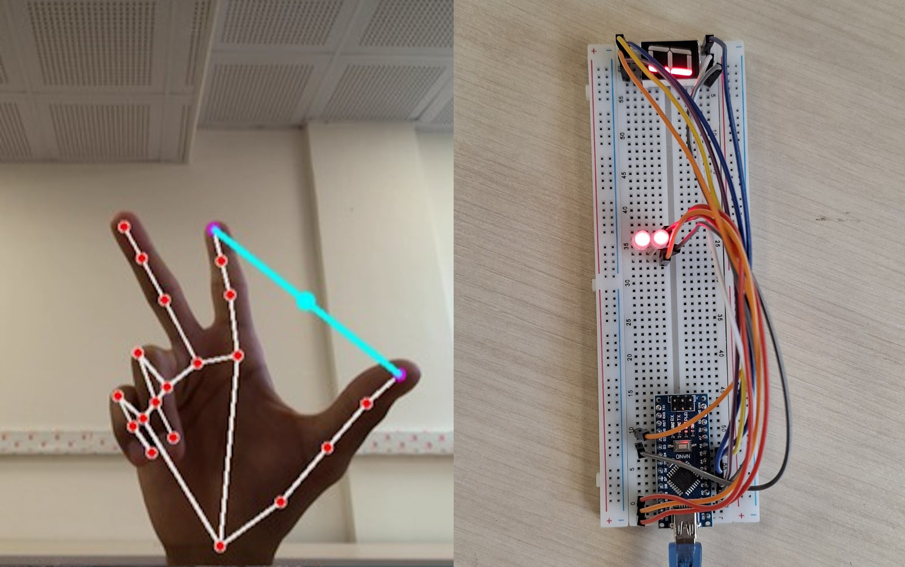
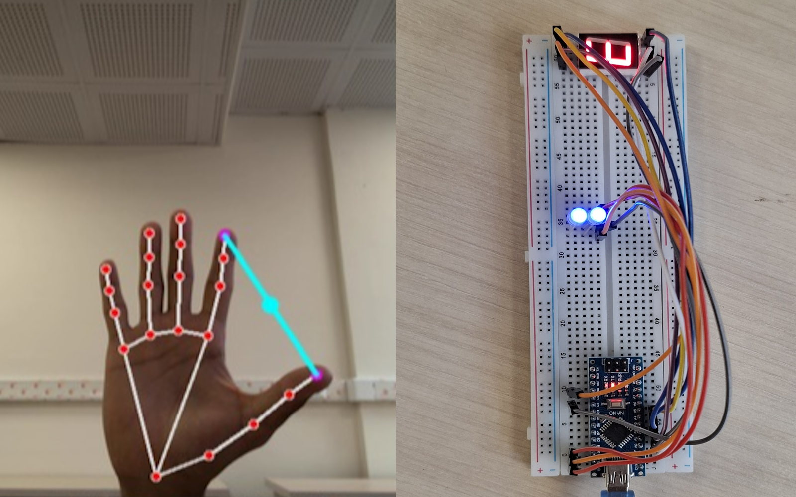

# 🖥️ LED Hand Gesture Controller

## 🌟 Overview

This project transforms your laptop into a smart gesture recognition hub, using its webcam to control an RGB LED connected to an Arduino Nano. It offers a seamless, touch-free interface where hand gestures control the LED's brightness and color in real time.

### 🔧 Technologies Used

- **MediaPipe** – Real-time hand tracking and gesture detection  
- **OpenCV** – Image processing and webcam handling  
- **Arduino Nano** – Microcontroller to drive RGB LED and 7-segment display  
- **Python** – Communication interface and gesture logic  
- **Serial Communication** – Data transfer between PC and Arduino  

---
## 🔍 Table of Contents

1. 🖐️ Introduction
2. 🖼️ Representation
3. 📦 Prerequisites
4. ⚡ How It Works

---
## 🖐️ Introduction

| Gesture | Functionality                    |
|---------|----------------------------------|
| **Thumb & Index Finger Distance** | Adjusts **brightness** of the LED |
| **Three Fingers (R, G, B)**      | Dynamically sets **RGB color** values |

- 👁️ The **webcam** captures the user's hand in real time.  
- 🧠 **MediaPipe** identifies hand landmarks and calculates distances.  
- 🎛️ These gestures are translated into LED parameters (intensity & color).  
- 🧵 A **serial connection** sends data to the Arduino.  
- 💡 The **Arduino** interprets this and drives the RGB LED and a 7-segment display.  

---
## 🖼️ Representation

  
  

---
## 📦 Prerequisites

- Python 3.7 or higher
- Laptop with built-in or external webcam
- Installed packages:
  - `opencv-python`
  - `mediapipe`
  - `numpy`
  - (Optional) `pyserial` if controlling a physical LED via serial port

---
## ⚡ How It Works

# Arduino: RGB & 7-Segment Controller

📅 **Last Updated:** May 28, 2025  
🔌 **Purpose:** Control an RGB LED’s color & brightness via serial commands—*and* show the selected channel on a seven-segment display simultaneously.

---

## 🚀 Features

- **Serial-driven control**  
  Send `"<channel>#<level>"` over USB-UART  
- **Multi-channel RGB**  
  Adjust each LED channel (R, G, B) from OFF (0) to MAX (9)  
- **Seven-segment feedback**  
  Active channel number (1–3) shows on the display  
- **Plug-and-play**  
  Minimal wiring and standard Arduino calls  

---

## 🔧 Hardware Setup

| Component            | Arduino Pin | Notes                               |
|----------------------|-------------|-------------------------------------|
| **Red LED Channel**  | D11         | PWM output                          |
| **Green LED Channel**| D10         | PWM output                          |
| **Blue LED Channel** | D12         | PWM output                          |
| **7-Seg Anode**      | D3          | Common-anode enable for digit pin   |
| **Segments A–G**     | A0–A5       | (Wire per your display’s datasheet) |

> **Tip:** Use current-limiting resistors (220 Ω–330 Ω) on every LED/segment pin.

> **Tip:** We can use analog pin in arduino by writing on DDRC and PORTC registers.

---

## 💻 Serial Command Reference

| Command String | Meaning                                          | Effect                                         |
|---------------:|--------------------------------------------------|------------------------------------------------|
| `1#0`          | Channel 1 (Red) → OFF                            | Red LED off; displays “1” on 7-seg             |
| `2#5`          | Channel 2 (Green) → Medium brightness (≈50%)     | Green LED ≈50%; displays “2”                   |
| `3#9`          | Channel 3 (Blue) → Max brightness                | Blue LED 100%; displays “3”                    |
| `X#Y`          | X = 1–3 (R, G, B), Y = 0–9 (map to 0–255 PWM)    | —                                              |

---

## 🚀 Future Expansion

Looking to take your RGB & 7-Segment Controller even further? Here are some exciting directions and project ideas to spark your creativity:

| Category             | Idea                                                                                     |
|----------------------|------------------------------------------------------------------------------------------|
| 🏠 Smart Home         | • **Mood Lighting Scenes**: Integrate with home automation (Home Assistant, MQTT) to trigger color/brightness presets based on time of day, weather, or presence sensors. • **Ambient Notifications**: Use subtle color pulses to notify you of new emails, calendar events, or security alerts. |
| 🚗 In-Car Companion   | • **Driver Status Indicator**: Monitor driver’s heart rate or drowsiness level (via Bluetooth sensor) and flash warning colors on the dashboard display. • **Navigation Feedback**: Pulse blue/green for upcoming turns, red for warnings (traffic jams, obstacles). |
| 🤖 Robotics & AI      | • **Color-Based Object Tracking**: Mount an RGB LED & sensor on a robot; change color intensity to follow or avoid objects of certain hues. • **AI Mood Lamp**: Connect to a sentiment-analysis API—your posts’ emotional tone drives the LED color. |
| 📱 Mobile & Web App   | • **Remote Control App**: Create an Android/iOS or web interface (Bluetooth/Wi-Fi) to adjust channels, save presets, and replay lighting “shows.” • **Voice Commands**: Integrate with Alexa or Google Assistant to say “Set channel 2 to 70%” and see it happen instantly. |
| 🎨 Interactive Art    | • **Reactive Installations**: Sync multiple controllers over I²C/SPI; each unit lights up in sequence, forming dynamic patterns in galleries or public spaces. • **Sound-To-Light**: Add a microphone or line-in; have the LEDs dance to music, with the 7-segment showing current BPM or frequency band. |
| 🌱 Environmental IoT  | • **Plant Health Monitor**: Combine with soil moisture & temperature sensors; LED fades from green (ideal) to red (dry) and seven-segment shows moisture %. • **Air Quality Indicator**: Connect to a VOC/CO₂ sensor—glow green for fresh air, amber for moderate, red for poor. |
| 🎮 Gamification       | • **Reaction-Time Tester**: Randomly light up one RGB channel; user must press a button fastest—7-segment displays reaction time in ms. • **Multiplayer Color Quiz**: Each player controls a channel; hit the matching color code on a buzzer, score shown on 7-segment. |
| 🌌 Fantasy & Sci-Fi   | • **Mini Starship Console**: Use channels to simulate engine glow, shields, weapons; seven-segment cycles through “warp drive” countdown. • **Magical Wand**: Embed controller in a wand-shaped enclosure; gesture-sensors change LED color—“spells” cast by specific moves. |

---

> **Got more ideas?**  
> Share your concepts or create a pull request—we’d love to see this project evolve!  

---
